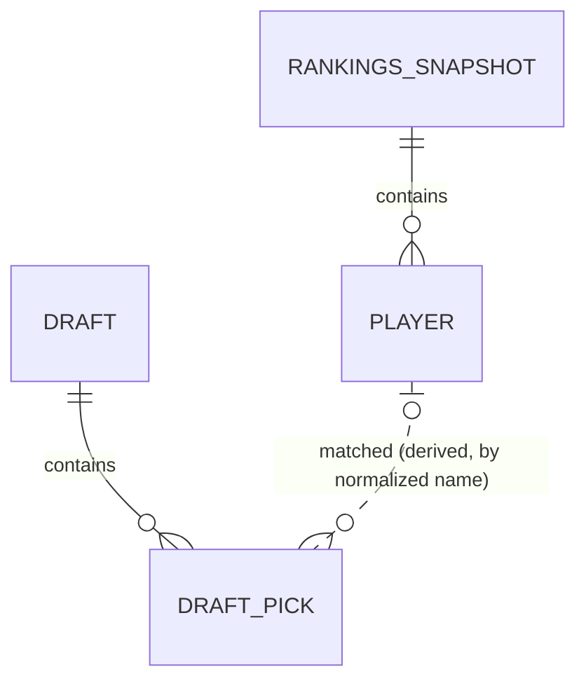

# Entity Model: FproDraftTracker

Abgeleitet aus [`requirements.md`](./requirements.md). FproDraftTracker hat
keine eigene Datenbank (siehe C-001, rein statisches Hosting): Die folgenden
Entitäten beschreiben die Datenstrukturen, die zwischen den Systemteilen
ausgetauscht werden — dem von GitHub Actions erzeugten Rankings-JSON und den
zur Laufzeit im Browser gehaltenen Objekten (Sleeper-Draftdaten). Die
Notation folgt dennoch der AIUP-Konvention, um Attribute und Beziehungen
eindeutig festzuhalten.

## Entity Relationship Diagram

Die Beziehung zwischen `PLAYER` und `DRAFT_PICK` ist nicht persistiert: Sie
wird zur Laufzeit im Frontend durch Namensabgleich berechnet (Grundlage für
den `drafted`-Status je Spieler, FR-002/FR-005) und bei jedem Laden der
Draft-Daten neu ermittelt.

### RANKINGS_SNAPSHOT

Das von der GitHub-Actions-Pipeline erzeugte JSON-Dokument mit den aktuellen
FantasyPros-ECR-Rankings; wird von der statischen Seite ausgeliefert.

| Attribute | Description | Data Type | Length/Precision | Validation Rules |
|-----------|-------------|-----------|-------------------|-------------------|
| generatedAt | Zeitpunkt, zu dem dieser Snapshot von der FantasyPros-API erzeugt wurde; Grundlage für den Aktualitäts-Banner (FR-010) und NFR-001/NFR-003 | DateTime | – | Not Null |
| source | Kennzeichnung der Datenquelle (z. B. "fantasypros-api") | String | 50 | Not Null |

### PLAYER

Ein einzelner Spieler-Eintrag innerhalb eines `RANKINGS_SNAPSHOT`.

| Attribute | Description | Data Type | Length/Precision | Validation Rules |
|-----------|-------------|-----------|-------------------|-------------------|
| player_id | Numerische FantasyPros-Player-ID (`id` in der API-Antwort); erlaubt gezieltes Nachfragen bei der API zu Debug-Zwecken | Long | – | Not Null |
| rank | Gesamt-Rang (PPR, Superflex/"OP") aus `rank.ECR.PPR.OP`, mit Fallback auf `rank.ECR.ROS-PPR.OP`, falls in der aktuellen Woche kein `PPR`-Bucket existiert (siehe architecture.md) | Integer | – | Not Null, Min: 1, Max: 999 |
| rankIsEstimated | `true`, wenn `rank` aus dem ROS-PPR-Fallback stammt statt aus dem wochenspezifischen PPR-Bucket; steuert die visuelle Kennzeichnung im Frontend | Boolean | – | Not Null |
| player_name | Vollständiger Spielername (Anzeige) | String | 100 | Not Null |
| first_name | Vorname laut FantasyPros-API; Grundlage für den Namensabgleich in UC-002 | String | 50 | Not Null |
| last_name | Nachname laut FantasyPros-API; Grundlage für den Namensabgleich in UC-002 | String | 50 | Not Null |
| position | Position kombiniert mit dem positionsspezifischen Rang derselben Scoring-Bucket wie `rank` (z. B. "RB81"), aus `position_id` + `rank.ECR.{PPR\|ROS-PPR}[position_id]` | String | 10 | Not Null |
| team | NFL-Team-Kürzel | String | 5 | Not Null |
| opponent | Gegner in der aktuellen Woche (z. B. "vs NE" / "at SEA"), aus der ESPN Scoreboard API (siehe architecture.md) | String | 10 | Optional (Bye Week oder ESPN-Abruf fehlgeschlagen) |

`drafted` ist kein gespeichertes Attribut, sondern ein zur Laufzeit
abgeleiteter Zustand (siehe Beziehung zu `DRAFT_PICK` oben).

### DRAFT

Repräsentiert den vom Nutzer verfolgten Sleeper-Draft.

| Attribute | Description | Data Type | Length/Precision | Validation Rules |
|-----------|-------------|-----------|-------------------|-------------------|
| draftId | Sleeper-Draft-ID, vom Nutzer eingegeben (FR-002) | String | 30 | Not Null |
| lastFetchedAt | Zeitpunkt des letzten erfolgreichen Abrufs der Picks über die Sleeper-API | DateTime | – | Not Null |

### DRAFT_PICK

Ein einzelner, über die Sleeper-API abgerufener Pick innerhalb eines
`DRAFT`.

| Attribute | Description | Data Type | Length/Precision | Validation Rules |
|-----------|-------------|-----------|-------------------|-------------------|
| pickNo | Fortlaufende Pick-Nummer im Draft | Integer | – | Not Null, Sequence |
| round | Runde, in der der Pick erfolgte | Integer | – | Not Null, Min: 1 |
| playerFirstName | Vorname des gedrafteten Spielers (laut Sleeper) | String | 50 | Not Null |
| playerLastName | Nachname des gedrafteten Spielers (laut Sleeper) | String | 50 | Not Null |
